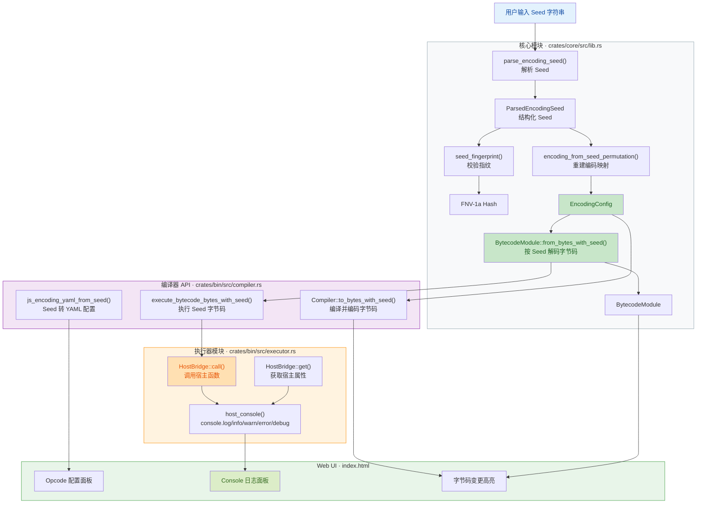
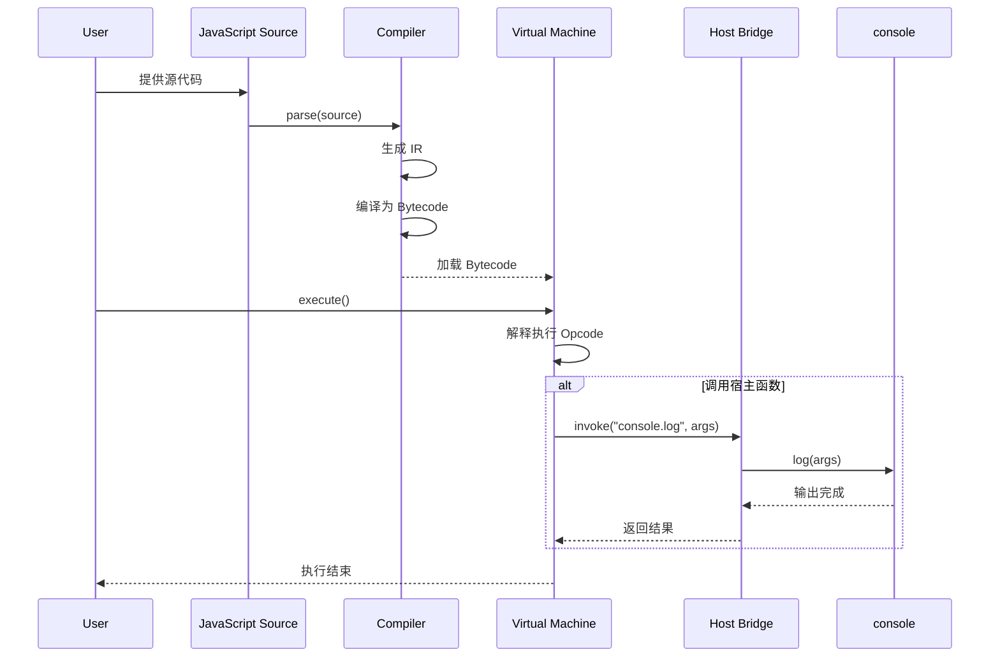

# JS VM

一个实验性的 JavaScript 虚拟机项目，包含 JS 到 IR、IR 到 bytecode、bytecode 执行器，以及基于 wasm 的 Web 测试页面。

## 可视化概览 (代码与逻辑图)





## Web Workbench

仓库根目录的 `index.html` 是浏览器测试台，依赖 `pkg/compiler` 中的 wasm 产物。

本地预览：

```bash
python3 -m http.server 4188 --bind 127.0.0.1
```

然后打开：

```text
http://127.0.0.1:4188/index.html
```

## Rust

```bash
cargo test
cargo check -p js_token_bin --target wasm32-unknown-unknown
```

## Build wasm

```bash
sh scripts/build-wasm.sh
```

Release 构建开启了 `opt-level = "z"`、LTO、单 codegen unit、`panic = "abort"` 和 symbol strip。
脚本会让 `wasm-pack` 先生成 web 目标，再用 `wasm-opt -Oz` 做二次体积优化。

## GitHub Pages

静态页面发布在 `gh-pages` 分支：

```text
https://open-nan.github.io/js_vm/
```
