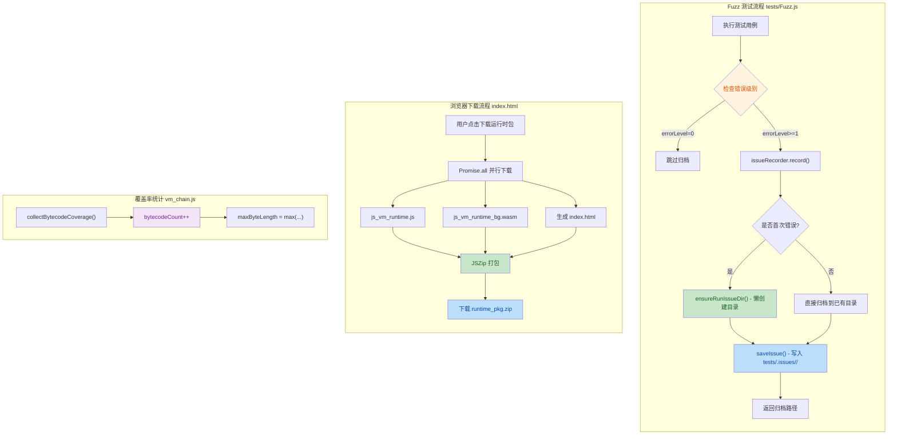

# JS VM

一个实验性的 JavaScript 虚拟机项目，包含 JS 到 IR、IR 到 bytecode、bytecode 执行器，以及基于 wasm 的 Web 测试页面。

## Documentation

- [Architecture](ARCHITECTURE.md): 当前执行架构、API、编译器、执行器、混淆器和 IR/Bytecode 结构说明。
- [JS Fuzzer](docs/js_fuzzer.md): 生成 JS 语料，并回放到 JS VM 完整链路。

## Web Workbench

仓库根目录的 `index.html` 是浏览器测试台，依赖 `pkg/compiler` 中的 wasm 产物。

本地预览：

```bash
python3 -m http.server 4188 --bind 127.0.0.1
```

然后打开：

```text
http://127.0.0.1:4188/index.html
```

## Rust

```bash
cargo test
cargo check -p js_token_core -p js_vm_compiler -p js_vm_runtime
```

## Chain Tests

链路测试集归档在 `tests/corpus`，按 `regressions`、`syntax`、`runtime`、`obfuscation`、`fixtures` 分类组织。测试文件使用 `*.test.js` / `*.test.ts` / `*.test.jsx` / `*.test.tsx` / `*.test.vue` 命名。

```bash
npm test
```

`tests/index.js` 是唯一测试入口。默认链路会依次运行 Rust 测试、构建 wasm、执行 corpus、执行 jsvu V8/VM 可观测输出对比，并追加一轮 fuzz smoke，覆盖编译、编码、随机 seed、执行器、异常对比和 opcode 覆盖率反馈。

按需运行：

```bash
npm run test:unit
npm run test:diff
npm run test:fuzz -- --time=30s
```

## JS Fuzzer

`tests/Fuzz.js` 用作 JS 语料生成器，生成的 JS 会回放到 JS VM 的编译、编码、seed 校验和执行链路。fuzzer 会从 `tests/corpus` 派生 seed，混入边界值种子，记录 VM 可观测输出 hash 和 opcode 覆盖率反馈；如果存在 `tests/.vendor/js_fuzzer`，会优先接入 V8 `ScriptMutator` 生成变异用例。mutation DB 默认由 `tests/corpus` 下所有测试用例生成，并写入覆盖清单。

运行摘要会统计总耗时、opcode 覆盖率和测试用例重复率；重复率按生成源码的 md5 指纹计算。

快速运行：

```bash
npm run test:fuzz -- --r=1 --seeds=1 --case-log=failures
```

完整运行：

```bash
npm run test:fuzz
```

限时运行会在指定时间内尽可能多地生成和执行 fuzz case：

```bash
npm run test:fuzz -- --time=30s
```

多线程运行会并行编译和执行不同 fuzz case，默认单线程：

```bash
npm run test:fuzz -- --threads=4 --time=2m
```

多线程模式只打印周期进度；异常结果进入异步日志队列后再输出和归档，避免 console I/O 限制并发吞吐。`--case-log` 只用于单线程调试输出。

默认只会在出现一级 VM/internal 异常时按需写入 `tests/.issues/<YY-MM-DD:HH:mm:ss>`；没有异常不会创建空归档目录。调试时可以追加：

```bash
npm run test:fuzz -- --log --error=5
```

`--log` 会把完整终端输出写入 `tests/.issues/<YY-MM-DD:HH:mm:ss>/log.txt`；`--error=0..5` 用来控制异常归档范围：`0` 关闭异常归档，`1` 只归档 internal failures / VM runtime timeouts / VM-only failures，`2` 增加 compile errors，`3` 增加 runtime errors / differential mismatches，`4` 增加 expected JS runtime errors，`5` 再增加 both-engine timeout / skipped。归档结果按状态写入 `tests/.issues/<YY-MM-DD:HH:mm:ss>/<status>/`，摘要写入 `tests/.issues/<YY-MM-DD:HH:mm:ss>/errors.log`。

需要清理历史归档或让错误过多时提前停止，可以追加：

```bash
npm run test:fuzz -- --clear-issues --error-limit=20
```

`--clear-issues` 会在运行前清空 `--issue-dir` 指向的历史 issues；`--error-limit` / `--max-errors` 会在 compile/runtime/expected-runtime/internal failures 达到阈值后停止继续生成 case。多线程模式下会通过共享停止标记让 worker 在当前 case 结束后退出；如果长时间没有 worker 消息，`--worker-idle-check-ms` 会定期检查 worker 是否仍然存活并输出等待日志，不再因为时间预算结束而强制终止 worker。单个 case 运行超过 `--worker-stuck-ms` 时会被判定为卡死，源码会按 md5 归档，然后终止对应 worker，避免整个 fuzz 被一个非终止 case 拖住。

已经归档到 `tests/.issues/<YY-MM-DD:HH:mm:ss>` 的异常可以按时间目录回放：

```bash
npm run test:fuzz -- --replay-issues=26-06-23:12:21:15 --replay-timeout-ms=30000
```

回放会重新执行该次 issue 目录下的源码，并在摘要中输出每个 worker 完成的 case 数。

V8 上游 `js_fuzzer` 镜像放在 `tests/.vendor/js_fuzzer`，通过下面命令更新：

```bash
npm run update:js-fuzzer
```

该更新入口复刻 `pull_v8_tool.sh` 的 sparse checkout 流程，只拉取 `tools/clusterfuzz/js_fuzzer`。

## CI

`.github/workflows/ci.yml` 会在 PR、`dev/codex`、`main` 和 merge queue 上运行完整验证：

```text
npm test
```

为了保证合并到 `main` 前测试必须全通过，需要在 GitHub 仓库设置中把 `CI / Verify Full Test Chain` 配置为 `main` 分支的 required status check。

## Git Hooks

安装本地提交钩子：

```bash
npm run hooks:install
```

之后每次 `git commit` 前会自动运行：

```text
npm test
```

任意一步失败都会阻止 commit。

## Source Map Debug

编译器会在 `CompilerArtifact` 上暴露 `source_map()`，也可以直接调用 `compiler.source_map(seed, externSlots, sourceFile)` 生成 Source Map v3 兼容 JSON。当前映射以 bytecode `pc` 为核心，额外在 `x_js_vm.sourceSpans`、`x_js_vm.pcRanges`、`x_js_vm.pcOps` 中记录源码 span、byte range、opcode 和函数段，便于把运行时错误里的 `pc` 反查到源码。

执行器的错误定位入口由 `source-map` feature 控制，默认 slim 运行包不包含它。需要错误 pc 映射包时可以单独构建：

```bash
npm run runtime:features -- pack --features=full,source-map
```

该包会导出 `js_execute_bytes_with_seed_debug()` / `js_execute_bytes_with_seed_debug_and_runtime_limits()`，返回 `{ ok, stage, value?, error?, stack }`，其中 `stack` 是可与 `x_js_vm.pcRanges` 对齐的 `pc` 列表。

断点调试由 `debugger` feature 控制，`debugger` 会自动包含 `source-map`：

```bash
npm run runtime:features -- pack --features=full,debugger
```

编译器生成的分文件 wrapper 会导出 `__jsVmDebugSession(breakpoints)`。浏览器控制台中可以这样定位源码：

```js
const debug = await import("./example.js");
const session = await debug.__jsVmDebugSession([{ line: 10, column: 0 }]);
session.inspect();
session.resume();
session.step();
session.frame(12);
```

`breakpoints` 可以传 `pc` 数字、`{ pc }`，或 `{ line, column }`。返回事件会包含 `pc`、`reason`、`registers`、`callStack` 和映射后的 `frame`。当前 DebugSession 主要覆盖顶层执行流；函数帧内的暂停/恢复会在后续 call-frame continuation 中继续完善。

## Runtime Perf

`npm run perf` 是运行时性能分析入口。它会使用 `runtime-profile` 版 Node executor 执行 bytecode，输出多轮耗时、p50/p90、opcode 热度、hot pc、HostBridge 计数，并在存在 `.bin.map` 时把 hot pc 映射到源码位置；默认还会调用 `dump-bytecode` 展示热点附近的 bytecode。

对 CLI/Workbench 生成的 wrapper 可以直接传 `.js`，脚本会自动解析 seed、bin、extern slots 和 source map；首次运行如果 `pkg/executor-node-profile` 不存在，可以追加 `--build-profile` 自动构建 profile executor：

```bash
npm run perf -- --wrapper /private/tmp/nan-blogs-vm-optimized/assets/app-9LyPQIdV.js --steps=1000000 --repeat=10 --build-profile
```

也可以手动传入 `.bin + seed`：

```bash
npm run perf -- --bin ./dist/app.bin --seed JSTKSEED2-... --externs Object,Array,window --no-dump
```

常用参数：

```text
--steps <n>      每轮 VM 最大执行步数，默认 1000000
--repeat <n>     统计轮数，默认 10
--warmup <n>     预热轮数，默认 1
--top <n>        输出 top opcode / hot pc 数量，默认 20
--dump-top <n>   自动 dump 前 n 个 hot pc 附近 bytecode，默认 5
--json <file>    写出结构化性能报告
```

## Build CLI

```bash
npm run build:wasm
```

Release 构建开启了 `opt-level = "z"`、LTO、单 codegen unit、`panic = "abort"` 和 symbol strip。
Rust CLI 会让 `wasm-pack` 先生成 web 目标，再用 `wasm-opt -Oz` 做二次体积优化。

也可以直接使用 Rust 构建命令：

```bash
cargo run -p js_vm_cli -- wasm --target web
cargo run -p js_vm_cli -- package ./examples/app --out ./dist/runtime --platform all --clean
cargo run -p js_vm_cli -- all -- ./examples/app --out ./dist/runtime --platform web --clean
```

`package` 会把目录下的 `.js/.ts` 编译成分文件运行时包：

```text
manifest.json
js-vm-loader.js
js-vm-loader.web.js
js-vm-loader.node.mjs
js_vm_runtime.js
js_vm_runtime_bg.wasm
bytecode/**/*.bin
sources/**/*
```

## GitHub Pages

静态页面发布在 `gh-pages` 分支：

```text
https://open-nan.github.io/js_vm/
```


```mermaid
flowchart TD
subgraph Fuzz["Fuzz 测试流程 tests/Fuzz.js"]
    direction TB
    A["执行测试用例"] --> B{检查错误级别}
    B -->|errorLevel=0| C["跳过归档"]
    B -->|errorLevel>=1| D["issueRecorder.record()"]
    D --> E{是否首次错误?}
    E -->|是| F["ensureRunIssueDir() - 懒创建目录"]
    E -->|否| G["直接归档到已有目录"]
    F --> H["saveIssue() - 写入 tests/.issues/<timestamp>/"]
    G --> H
    H --> I["返回归档路径"]
    
    style B fill:#fff3e0,color:#e65100
    style F fill:#c8e6c9,color:#1a5e20
    style H fill:#bbdefb,color:#0d47a1
end

subgraph Browser["浏览器下载流程 index.html"]
    direction TB
    J["用户点击下载运行时包"] --> K["Promise.all 并行下载"]
    K --> L["js_vm_runtime.js"]
    K --> M["js_vm_runtime_bg.wasm"]
    K --> N["生成 index.html"]
    L --> O["JSZip 打包"]
    M --> O
    N --> O
    O --> P["下载 runtime_pkg.zip"]
    
    style O fill:#c8e6c9,color:#1a5e20
    style P fill:#bbdefb,color:#0d47a1
end

subgraph Coverage["覆盖率统计 vm_chain.js"]
    Q["collectBytecodeCoverage()"] --> R["bytecodeCount++"]
    R --> S["maxByteLength = max(...)"]
    
    style R fill:#f3e5f5,color:#7b1fa2
end
```


# TODO
- [ ] 将分支列为
main
  ↓ 拉分支
dev/xxx
  ↓ push 后跑单元测试
PR → test
  ↓ test 分支跑模糊测试
PR → main
  ↓ main 合并后自动部署
- [ ] 接入 JS Fuzzer 在 test 分支提起 PR 的时候运行
- [ ] 优化 UI，增加更多功能
